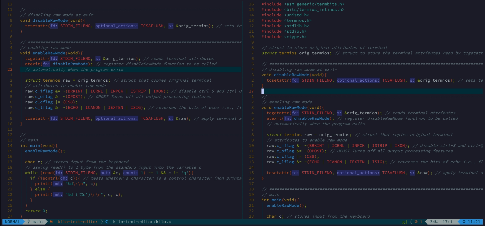
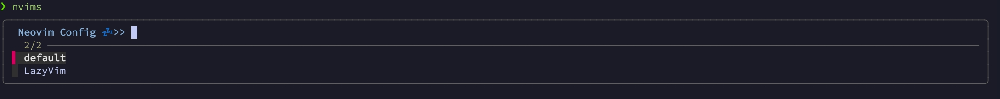

# 💤 LazyVim
<samp>
  This is my custom template for <a href="https://github.com/LazyVim/LazyVim">LazyVim.</a>
   Refer to the <a href="https://lazyvim.github.io/installation">documentation</a> to get started.
  My configuration is based on <a href="https://youtu.be/fFHlfbKVi30?si=nmaGGZij-V3OP8OQ">devaslife</a>'s video with some of my own settings and plugins.
  <br>
  Feel free to add and change things according to your preferences.
</samp>

## Dashboard
<samp> I am using custom dashboard for the LazyVim from nvimdev. Replace the commented line with your own custom logo.</samp>

```lua
  {
    "nvimdev/dashboard-nvim",
    event = "VimEnter",
    opts = function(_, opts)
      local logo = [[ 
              -- Your custom logo 
      ]]
      logo = string.rep("\n", 8) .. logo .. "\n\n"
      opts.config.header = vim.split(logo, "\n")
    end,
  },
```


## Plugins
    
| Plugins                  | Description                                                                               | Links |
|--------------------------|-------------------------------------------------------------------------------------------|-------|
| **Mason**                | <samp> A package manager for installing LSP servers, DAP servers, linters, and formatters. </samp>       | [🔗](https://github.com/williamboman/mason.nvim) |
| **flash**                | <samp> Enhances motion in the editor, enabling more intuitive text navigation. </samp>                  | [🔗](https://github.com/folke/flash.nvim) |
| **lualine**              | <samp> A fast and customizable status line plugin for Neovim. </samp>                                   | [🔗](https://github.com/nvim-lualine/lualine.nvim) |
| **noice**                | <samp> A highly configurable UI for command messages, popups, and notifications. </samp>                 | [🔗](https://github.com/folke/noice.nvim) |
| **treesitter**           | <samp> Syntax highlighting and parsing based on Tree-sitter for better performance and accuracy. </samp> | [🔗](https://github.com/nvim-treesitter/nvim-treesitter) |
| **notify**               | <samp> A stylish notification manager for Neovim. </samp>                                               | [🔗](https://github.com/rcarriga/nvim-notify) |
| **which-key**            | <samp> Displays available keybindings in a popup for easier discovery. </samp>                           | [🔗](https://github.com/folke/which-key.nvim) |
| **trouble**              | <samp> A pretty list to help you manage and navigate diagnostics, references, etc. </samp>               | [🔗](https://github.com/folke/trouble.nvim) |
| **ts-comments**          | <samp> A Neovim plugin for better comment handling using Tree-sitter. </samp>                           | [🔗](https://github.com/JoosepAlviste/nvim-ts-context-commentstring) |

## Theme

<samp>
  I am currently using solarized osaka theme by <a href="https://github.com/craftzdog/solarized-osaka.nvim">craftzdog</a> as it looks very cozy and vibrant.
  <br>
</samp>


```lua
  {
    "craftzdog/solarized-osaka.nvim",
    lazy = true,
    priority = 1000,
    opts = function()
      return {
        transparent = true,
      }
    end,
  }
```



## Multiple configs
<samp>If you want to use mulitple configs of Neovim and Vim such as AstroVim, LunarVim, NvChad and ofcourse LazyVim then follow the below steps. </samp>

> **A note about cloning other configs**: <samp> Clone the repository of the config you are going to use the most in the default directory of Neovim `~/.config/nvim` and clone the other repositories of different configs into their respective directories with thier names similar to thier configs.</samp>
>
><samp> for example, if you want to use NvChad on daily basis then clone it's repository into default directory `~/.config/nvim` and if you want to use LunarVim also then clone it's repository into following directory `~/.config/LunarVim` </samp>

#### 1. Update `./zshrc`
<samp>Adding the following lines in your `./zshrc` file will create a `nvims` command that can be used for accessing different configs. It shows the prompt with different available configuration. If you do not select any configuration it returns **nothing selected**. </samp>


